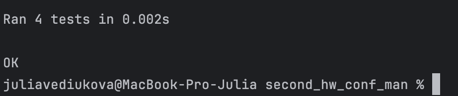
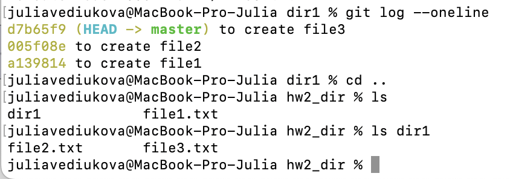
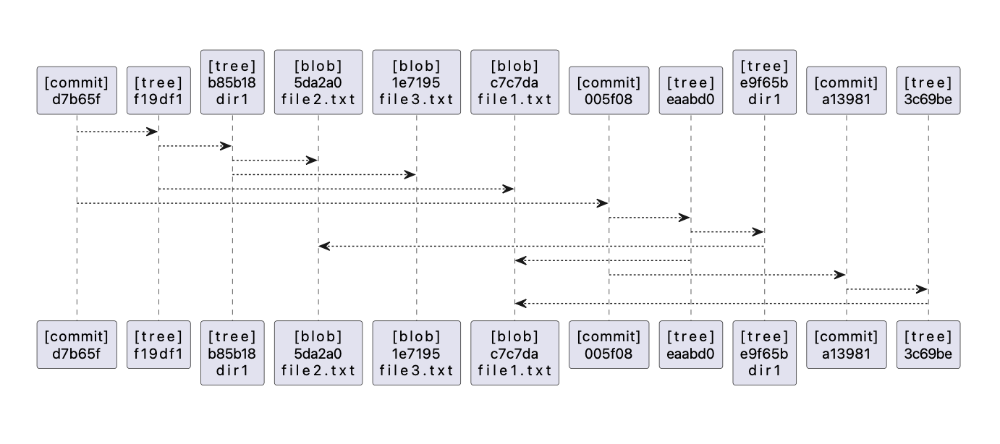

# Задание №2

Разработать инструмент командной строки для визуализации графа зависимостей, включая транзитивные зависимости.  
Сторонние программы или библиотеки для получения зависимостей использовать **нельзя**.  

Зависимости определяются для **Git-репозитория**.  
Для описания графа зависимостей используется представление **PlantUML**.  
Визуализатор должен выводить результат на экран в виде **кода**.

---

### Построение графа

Необходимо построить граф зависимостей для коммитов, в узлах которого находятся списки файлов и папок.  
Граф необходимо строить **только для тех коммитов**, где фигурирует файл с заданным **хеш-значением**.

---

### Конфигурационный файл

Конфигурационный файл имеет формат **TOML** и содержит:
- **`path_to_visualizer`** — путь к программе для визуализации графов.
- **`path_to_repository`** — путь к анализируемому репозиторию.
- **`path_to_output_file`** — путь к файлу-результату в виде кода.
- **`file_hash`** — файл с заданным хеш-значением в репозитории.

## Результаты тестов

## Коммиты и структура

## Полученный граф

